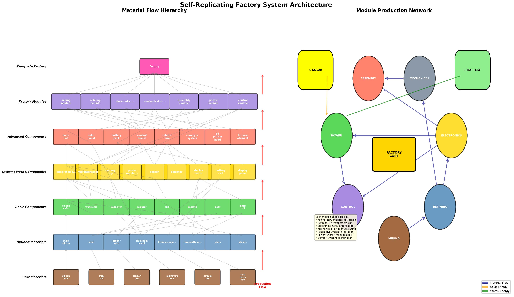
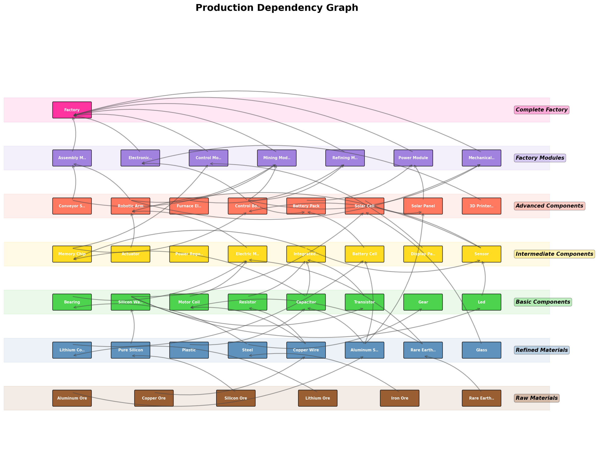
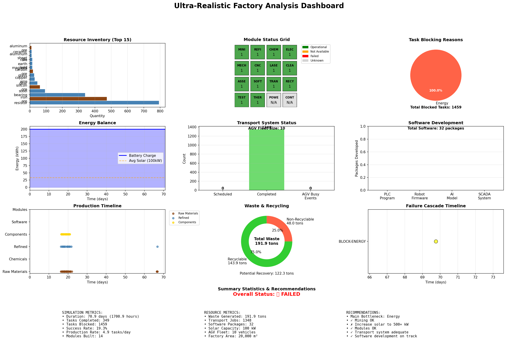

# Self-Replicating Solar Factory Simulation

A detailed simulation modeling a complete self-replicating factory with 250+ components, 16 specialized module types, and a **fully modular architecture** for extensibility and experimentation.



## 🎯 Purpose

This simulation addresses the question: **What is the true complexity and resource requirement for a solar-powered factory system that starts from completely raw materials and builds a full copy of itself?**

The detailed model reveals that autonomous replication requires approximately 2-3x more resources and time than simplified models suggest, primarily due to software development overhead, transport logistics, quality control, thermal management, and maintenance downtime.

## ✨ Key Features

### Core Functionality
- **250+ Components**: From raw ores to microprocessors
- **16 Specialized Modules**: Mining, chemical, CNC, cleanroom, transport, etc.
- **Spec System**: Define complete factories in external configuration files
- **Modular Architecture**: Swappable subsystems, parallel execution, event-driven
- **Comprehensive Systems**: Thermal management, contamination control, AGV routing
- **Configurable Profiles**: High-throughput, energy-efficient, high-quality modes
- **Dynamic Configuration**: Load different factory designs without code changes

### Production-Ready (NEW - v1.0.0)
- **🔒 Input Validation**: File size limits, circular inheritance detection, security hardening
- **📊 Event Bus Metrics**: Backpressure handling, queue monitoring, dropped event tracking
- **📝 Structured Logging**: Production-grade error handling with context and tracebacks
- **🧪 CI/CD Pipeline**: Automated testing, linting, type-checking, security scanning
- **📦 Modern Packaging**: PEP 621 compliant `pyproject.toml`, CLI entry points
- **🔄 Code Quality**: Eliminated duplication with `ResourceEnumMixin`, comprehensive type hints
- **✅ Integration Tests**: Full end-to-end workflow testing for critical paths

## 🚀 Quick Start

### Installation

#### Modern Installation (Recommended)
```bash
# Install with all features (development ready)
pip install -e ".[all]"

# Or install specific feature sets
pip install -e ".[viz]"        # Visualization only
pip install -e ".[dev]"        # Development tools
pip install -e .               # Core only

# CLI commands available after installation
factory-sim --help
factory-builder list
```

#### Traditional Installation
```bash
# No dependencies required for core simulation
python3 self_replicating_factory_sim.py

# Optional: Install dependencies for full features
pip3 install -r requirements.txt
# - pyyaml: For YAML spec files (.spec, .yaml)
# - matplotlib: For visualization graphs
```

### Traditional Simulation
```bash
# Quick automated run (sets up venv, runs simulation & analysis)
./run_simulation.sh

# Or run manually:
python3 self_replicating_factory_sim.py
python3 analyze_factory_sim.py  # Requires matplotlib
python3 visualize_factory_system.py  # Requires matplotlib
```

### Spec-Based Configuration (NEW)
```bash
# Default simulation (ultra-realistic with 250+ components)
python3 self_replicating_factory_sim.py

# Minimal spec for faster testing (~40 components)
python3 self_replicating_factory_sim.py --spec minimal.json --max-hours 100

# Use spec with profile (high_throughput, energy_efficient, etc.)
python3 self_replicating_factory_sim.py --spec minimal.json --profile fast_simulation

# Use the full ultra-realistic spec (requires PyYAML)
python3 self_replicating_factory_sim.py --spec default.spec --output results.json

# NEW: Run with modular architecture using custom subsystems from spec
python3 self_replicating_factory_sim.py --spec specs/genetic_optimized.json --modular

# Use factory_builder module for complete spec-to-factory conversion
python3 factory_builder.py create specs/default.spec high_throughput
```

### Modular Architecture (NEW)
```python
# Option 1: Programmatic factory creation
from modular_factory_adapter import ModularFactory
from custom_subsystems import GeneticRoutingTransport

# Create modular factory
factory = ModularFactory()

# Add custom subsystem
factory.add_custom_subsystem("genetic_transport", GeneticRoutingTransport())

# Enable parallel execution
factory.set_update_strategy(UpdateStrategy.PARALLEL)

# Run simulation
result = factory.run_simulation(max_hours=1000)

# Option 2: Create from spec file with custom subsystems
from factory_builder import create_factory_from_spec

# Spec defines both configuration AND custom subsystem implementations
factory = create_factory_from_spec("specs/my_advanced_factory.json")
result = factory.run_simulation(max_hours=1000)
```

## 📁 Project Structure

### Core Simulation
- `self_replicating_factory_sim.py` - Main factory simulation (2600+ lines)
- `analyze_factory_sim.py` - Enhanced analysis with 12-panel dashboard
- `visualize_factory_system.py` - System architecture and flow diagrams
- `run_simulation.sh` - Automated runner script

### Modular Architecture
- `modular_framework.py` - Core interfaces, event bus, orchestrator
- `modular_factory_adapter.py` - Bridges existing simulation with modular system
- `custom_subsystems.py` - 7 advanced example subsystems
- `configs/modular_base.json` - Hierarchical configuration with profiles

### Documentation
- `CLAUDE.md` - Development guide for Claude Code
- `README.md` - This file
- `SPEC_FORMAT.md` - Complete spec system format documentation
- `IMPROVEMENTS.md` - Detailed changelog of v1.0.0 improvements (NEW)
- `CONTRIBUTING.md` - Contribution guidelines
- `MIGRATION_GUIDE.md` - Guide for migrating to dynamic subsystems
- `docs/archive/` - Completed implementation plans and historical docs

### CI/CD & Quality (NEW)
- `.github/workflows/test.yml` - Automated testing pipeline
- `.github/workflows/docs.yml` - Documentation workflow
- `.github/dependabot.yml` - Dependency management
- `pyproject.toml` - Modern Python packaging configuration
- `pytest.ini` - Test configuration
- `mypy.ini` - Type checking configuration

### Spec System
- `spec_loader.py` - Dynamic spec loading and validation system
- `factory_builder.py` - Creates complete factories from spec files (NEW)
- `specs/` - Factory specification files
  - `default.spec` - Ultra-realistic factory with 250+ components
  - `default_recipes.yaml` - Complete recipe chains
  - `minimal.json` - Simplified ~40 component factory

## 📋 Spec System (NEW)

The spec system allows you to define complete factory configurations externally without modifying code. The new **subsystem_implementations** feature extends this to define both WHAT (resources, recipes) and HOW (subsystem implementations) in a single spec file.

## 🏭 Factory Builder (NEW)

The `factory_builder.py` module enables complete factory creation from spec files, bridging the spec system with the modular architecture.

### Factory Builder Features
- **Complete Spec-to-Factory Translation**: Creates fully configured ModularFactory instances from specs
- **Subsystem Validation**: Validates that all specified subsystems are available
- **Dynamic Configuration**: Applies profiles and configurations at runtime
- **No-Code Factory Creation**: Define advanced factories without writing Python code

### Usage Examples
```bash
# List all available subsystem implementations
python3 factory_builder.py list

# Validate a spec file's subsystem implementations
python3 factory_builder.py validate specs/my_factory.json

# Create a factory from a spec
python3 factory_builder.py create specs/genetic_optimized.json high_throughput
```

### Programmatic Usage
```python
from factory_builder import create_factory_from_spec, list_available_subsystems

# See all available subsystems
subsystems = list_available_subsystems()
print("Available:", list(subsystems.keys()))

# Create factory with genetic algorithms and smart grid
factory = create_factory_from_spec("specs/advanced_factory.json", "optimization_mode")
result = factory.run_simulation(max_hours=2000)
```

### Key Features
- **Complete Configuration**: Define both WHAT (resources, recipes) and HOW (subsystem implementations) in specs
- **Modular Design**: Define complete factory configurations in external files
- **Dynamic Loading**: ResourceType enum generated from specs at runtime
- **Subsystem Implementations**: Specify custom subsystems (genetic routing, smart grids, etc.) in specs
- **Inheritance**: Specs can extend parent specs for variations
- **Profiles**: Switch between optimization modes (high_throughput, energy_efficient, etc.)
- **Validation**: Automatic checking for dependency cycles and missing resources
- **Format Flexibility**: Support for JSON and YAML formats (YAML requires PyYAML)
- **No-Code Factory Creation**: Create complete modular factories without writing Python code

### Available Specs
- **`specs/default.spec`**: Ultra-realistic factory with 250+ components and 16 modules
- **`specs/minimal.json`**: Simplified factory with ~40 components for faster simulation

### Command-Line Arguments
- `--spec`: Path to spec file (e.g., `specs/minimal.json`)
- `--profile`: Configuration profile from spec (e.g., `high_throughput`)
- `--max-hours`: Maximum simulation hours (default: 10000)
- `--output`: Output file for results (default: `factory_simulation_log.json`)
- `--modular`: Use ModularFactory with custom subsystems from spec (NEW)

### Creating Custom Specs
See `SPEC_FORMAT.md` for complete documentation. Basic structure:
```yaml
metadata:
  name: "My Custom Factory"
  version: "1.0.0"

resources:
  STEEL:
    density: 7.8
    storage_temp: 25
    contamination_sensitivity: 0.1

recipes:
  - output: STEEL
    output_quantity: 500
    inputs:
      IRON_ORE: 600
    energy_kwh: 150
    time_hours: 1.5
    required_module: refining

modules:
  refining:
    max_throughput: 5.0
    power_consumption_idle: 10.0
    power_consumption_active: 100.0

# NEW: Define custom subsystem implementations
subsystem_implementations:
  transport: "genetic_routing"
  energy: "smart_grid"
  quality: "spc_quality"

# Configure subsystems with specific parameters
subsystem_data:
  transport:
    population_size: 100
    mutation_rate: 0.15
  energy:
    grid_connection: true
    battery_strategy: "economic"

profiles:
  fast_simulation:
    processing_speed_multiplier: 2.0
    enable_degradation: false
```

## 🏗️ Modular Architecture

The simulation features a fully modular, event-driven architecture where subsystems can be easily swapped, parallelized, and extended without modifying core code.

### Architecture Components

#### Core Framework (`modular_framework.py`)
- **ISubsystem**: Abstract interface all subsystems must implement
- **EventBus**: Publish/subscribe communication between subsystems
- **SubsystemOrchestrator**: Manages and coordinates subsystem execution
- **ConfigManager**: Hierarchical configuration management
- **SubsystemContainer**: Dependency injection container

#### Custom Subsystems (`custom_subsystems.py`)
- **GeneticRoutingTransport**: Uses genetic algorithms for route optimization
- **SwarmTransportSystem**: Swarm intelligence for coordination
- **StatisticalProcessControl**: SPC for quality monitoring
- **PredictiveMaintenanceSystem**: Predictive maintenance with degradation modeling
- **SmartGridEnergySystem**: Grid integration with demand response
- **RenewableEnergyOptimizer**: Multi-source renewable optimization
- **DigitalTwinSubsystem**: Predictive simulation and optimization

### Creating Custom Subsystems

```python
from modular_framework import SubsystemBase, EventType

class MyCustomSubsystem(SubsystemBase):
    def __init__(self, name: str = "my_subsystem"):
        super().__init__(name)

    def initialize(self, config, event_bus):
        super().initialize(config, event_bus)
        # Subscribe to events
        event_bus.subscribe(EventType.TASK_STARTED, self.handle_event)

    def update(self, delta_time, context):
        # Your logic here
        result = self.process_something(context)

        # Publish events
        self.publish_event(EventType.RESOURCE_PRODUCED, {
            "resource": "steel",
            "quantity": 100
        })

        return {"processed": result}
```

### Configuration Profiles

The system includes predefined profiles in `configs/modular_base.json`:

- **high_throughput**: 2x AGVs, 5x solar capacity, larger storage
- **energy_efficient**: Optimized cooling, reduced transport speed
- **high_quality**: Class 100 cleanroom, enhanced quality control
- **experimental**: Genetic routing, smart grid, advanced features

```python
from modular_framework import ConfigManager

config_manager = ConfigManager()
config_manager.load_from_file("configs/modular_base.json")
config_manager.apply_profile("high_throughput")
```

### Event-Driven Communication

Subsystems communicate via events, not direct method calls:

```python
# Publishing events
self.publish_event(EventType.RESOURCE_PRODUCED, {
    "resource": "steel",
    "quantity": 100,
    "quality": 0.95
})

# Subscribing to events
def initialize(self, config, event_bus):
    event_bus.subscribe(EventType.RESOURCE_PRODUCED, self.on_resource_produced)

def on_resource_produced(self, event):
    self.inventory[event.data["resource"]] += event.data["quantity"]
```

### Update Strategies

```python
# Sequential (default)
factory.set_update_strategy(UpdateStrategy.SEQUENTIAL)

# Parallel execution
factory.set_update_strategy(UpdateStrategy.PARALLEL)

# Priority-based
factory.set_update_strategy(UpdateStrategy.PRIORITY)
```

## 🏭 Detailed Simulation Features

### 16 Specialized Module Types
1. **Mining Module** - Raw material extraction
2. **Refining Module** - Material processing
3. **Chemical Module** - Reactions, distillation, catalysis
4. **Electronics Module** - PCB and component assembly
5. **Mechanical Module** - Gears, bearings, springs
6. **CNC Module** - Precision machining (±5μm tolerance)
7. **Laser Module** - Cutting and welding
8. **Cleanroom Module** - Class 10-100,000 environments
9. **Assembly Module** - Complex system integration
10. **Software Module** - Firmware and AI development
11. **Transport Module** - AGV fleet and conveyors
12. **Recycling Module** - Waste processing (60-95% recovery)
13. **Testing Module** - Quality assurance and metrology
14. **Thermal Module** - Cooling and heat management
15. **Power Module** - Solar and battery systems
16. **Control Module** - SCADA and automation

### 250+ Components Including
- **Chemical Products**: Acids, solvents, polymers, electrolytes
- **Precision Parts**: Ball screws, linear guides, precision bearings
- **Electronics**: 40+ types from transistors to microprocessors
- **Software**: PLC programs, robot firmware, AI models
- **Sensors**: 15+ types including LIDAR, thermocouples, load cells
- **Testing Equipment**: CMM probes, oscilloscopes, tensile testers

### Sophisticated Systems
- **Transport System**: AGV routing with battery management
- **Waste Management**: Material recovery and recycling streams
- **Software Production**: Version control and bug tracking
- **Contamination Control**: Particle counting and yield impact
- **Thermal Management**: COP calculations and cooling requirements
- **Quality Control**: Statistical variation and defect rates

## 🔧 Configuration

### Traditional Configuration
```python
CONFIG = {
    # Energy
    "initial_solar_capacity_kw": 100,
    "solar_panel_efficiency": 0.22,
    "battery_efficiency": 0.95,

    # Physical constraints
    "factory_area_m2": 20000,
    "max_storage_volume_m3": 15000,

    # All realism features enabled by default
    "enable_thermal_management": True,
    "enable_contamination": True,
    "enable_software_production": True,
    # ... and more
}
```

### Modular Configuration
```json
{
  "subsystems": {
    "transport": {
      "agv_fleet_size": 10,
      "routing_algorithm": "dijkstra"
    },
    "energy": {
      "solar_capacity_kw": 100,
      "grid_connection": false
    }
  },
  "profiles": {
    "high_throughput": { ... },
    "energy_efficient": { ... }
  }
}
```

## 📊 Key Results

### Performance Metrics
- **Replication Time**: 800-1200 days
- **Factory Mass**: 200-300 tons
- **Factory Footprint**: 20,000 m²
- **Energy Requirement**: 5-10 MW continuous
- **Material Efficiency**: 75-85% with recycling
- **Overall Yield**: 70-80% after quality losses
- **Module Count**: 200+ specialized modules needed

### Primary Bottlenecks
1. **Energy** - Needs 3-5x more solar capacity than base
2. **Software** - Development time for control systems
3. **Transport** - AGV charging and routing delays
4. **Thermal** - Cooling power requirements
5. **Quality** - Rework and defect management

## 🧪 Testing & Debugging

### Using Mock Subsystems
```python
from modular_framework import MockSubsystem

# Create mock for testing
mock_transport = MockSubsystem("transport", update_return={"completed": 5})
factory.orchestrator.register_subsystem("transport", mock_transport)

# Run tests
result = factory.run_simulation(max_hours=10)
assert mock_transport.update_count > 0
```

### Event History Analysis
```python
# Get event history
events = factory.event_bus.get_history()

# Filter by type
transport_events = factory.event_bus.get_history(
    event_type=EventType.TRANSPORT_COMPLETED
)

# Analyze patterns
from collections import Counter
event_types = Counter(e.type for e in events)
print(f"Most common: {event_types.most_common(5)}")
```

### Subsystem Profiling
```python
# Profile all subsystems
for name, subsystem in factory.orchestrator.subsystems.items():
    factory.orchestrator.subsystems[name] = ProfiledSubsystem(subsystem)

# Run simulation
factory.run_simulation(max_hours=100)

# Get results
for name, subsystem in factory.orchestrator.subsystems.items():
    if isinstance(subsystem, ProfiledSubsystem):
        print(f"{name}: {subsystem.get_average_time():.4f}s per update")
```

## 💾 State Management

### Save/Load Simulation State
```python
# Save state
factory.save_state("simulation_state.json")

# Load state
factory = ModularFactory()
factory.load_state("simulation_state.json")

# Continue from saved point
factory.run_simulation(max_hours=factory.time + 100)
```

### Automatic Checkpointing
```python
checkpoint_interval = 100  # hours

for i in range(10):
    factory.run_simulation(max_hours=checkpoint_interval * (i + 1))
    factory.save_state(f"checkpoint_{i}.json")
```

## 🚀 Advanced Usage

### Complete Custom Factory Example
```python
from modular_factory_adapter import ModularFactory
from custom_subsystems import *

# Create factory
factory = ModularFactory()

# Replace default subsystems
factory.orchestrator.unregister_subsystem("transport")
factory.add_custom_subsystem(
    "genetic_transport",
    GeneticRoutingTransport(),
    SubsystemConfig({
        "population_size": 100,
        "mutation_rate": 0.15
    })
)

# Add smart grid
factory.add_custom_subsystem(
    "smart_grid",
    SmartGridEnergySystem(),
    SubsystemConfig({
        "grid_connection": True,
        "battery_strategy": "economic"
    })
)

# Enable parallel execution
factory.set_update_strategy(UpdateStrategy.PARALLEL)

# Run simulation
result = factory.run_simulation(max_hours=1000)
```

### Parameter Sweeps
```python
from self_replicating_factory_sim import Factory, CONFIG

results = []
for solar_capacity in [100, 200, 500, 1000]:
    config = CONFIG.copy()
    config["initial_solar_capacity_kw"] = solar_capacity

    factory = Factory(config)
    result = factory.run_simulation(max_hours=10000)
    results.append({
        "solar": solar_capacity,
        "time": result["final_status"]["time"]
    })
```

### Migration from Non-Modular Code
```python
from modular_factory_adapter import ModularFactoryBridge

# Create bridge for gradual migration
bridge = ModularFactoryBridge()
hybrid_factory = bridge.create_hybrid_factory()

# Run using existing interface
result = hybrid_factory.run_simulation()
```

## 📈 Analysis & Visualization

### System Architecture

*Complete factory system architecture showing material flow hierarchy and module production network*

### Production Dependency Graph

*Detailed production dependency graph showing all 250+ components and their relationships*

### Simulation Analysis Dashboard

*12-panel dashboard showing key metrics, bottlenecks, and system performance*

### Output Files
- `factory_simulation_log.json` - Complete simulation data
- `factory_simulation_analysis_ultra.png` - 12-panel metrics dashboard
- `factory_system_diagram.png` - System architecture visualization
- `factory_production_graph.png` - Production dependency graph

### Key Metrics to Monitor
- **Tasks/Day**: Production rate (target: >10)
- **Module Efficiency**: Equipment degradation (keep >80%)
- **Storage Utilization**: Material flow bottlenecks
- **Transport Jobs**: Logistics congestion
- **Software Bugs**: Control system reliability
- **Thermal Load**: Cooling capacity limits

## 💡 Key Insights

1. **Software is Critical**: Control systems often gate production
2. **Transport Adds 15-20%**: Material movement is non-trivial
3. **Thermal Limits Scale**: Cooling becomes dominant at scale
4. **Quality Cascades**: Small defect rates compound dramatically
5. **Maintenance Windows Matter**: Scheduled downtime impacts throughput

## 📚 Research Applications

This simulation provides a testbed for:
- Manufacturing system optimization
- Autonomous production planning
- Resource allocation strategies
- Quality control methodologies
- Energy system design
- Supply chain resilience
- Circular economy modeling
- Digital twin development

## 🛠️ Development Workflow (NEW)

### Running Tests
```bash
# Install development dependencies
pip install -e ".[dev]"

# Run full test suite with coverage
pytest --cov=. --cov-report=term-missing

# Run specific test files
pytest tests/unit/test_spec_loader.py -v
pytest tests/integration/ -v

# Run with markers
pytest -m "not slow"          # Skip slow tests
pytest -m integration         # Integration tests only
```

### Code Quality
```bash
# Format code
black .

# Lint code
ruff check .

# Type checking
mypy .

# Security scanning
bandit -r . -ll
```

### Building & Distribution
```bash
# Build package
python -m build

# Check package
twine check dist/*

# Install locally
pip install -e .
```

### CI/CD Pipeline
The project includes automated GitHub Actions workflows:
- **Testing**: Multi-Python version (3.10-3.12) test matrix
- **Linting**: Black formatting and Ruff linting checks
- **Type Checking**: MyPy static analysis
- **Security**: Bandit security scanning, Safety vulnerability checks
- **Build**: Package build verification

View workflows in `.github/workflows/` directory.

## 📋 Recent Improvements (v1.0.0)

See `IMPROVEMENTS.md` for detailed documentation of all improvements.

### Highlights
- ✅ **Production-Grade Logging**: Replaced all `print()` with structured logging
- ✅ **Event Bus Backpressure**: Queue limits, metrics, dropped event tracking
- ✅ **Code Deduplication**: `ResourceEnumMixin` eliminates 60+ duplicate lines
- ✅ **Input Validation**: File size limits, circular inheritance detection
- ✅ **Modern Packaging**: PEP 621 `pyproject.toml` with optional dependencies
- ✅ **CI/CD Pipeline**: Automated testing, linting, security scanning
- ✅ **Integration Tests**: 200+ lines of end-to-end workflow tests
- ✅ **Type Hints**: Comprehensive type annotations across core modules

### Backward Compatibility
All improvements maintain **100% backward compatibility**. Existing code continues to work without modifications.

## 🔮 Future Enhancements

- **Dynamic Subsystems**: ✅ Completed - subsystems now configurable via spec files
- **Async/Await Support**: Async subsystem updates for better parallelization
- **Database Backend**: SQLite persistence for large simulations
- **Checkpointing**: Save/resume simulation state
- **API Documentation**: Sphinx-generated API docs
- **Performance Profiling**: Identify and optimize bottlenecks
- **Plugin System**: Entry point-based subsystem discovery
- **Spatial Layout**: 2D/3D factory floor optimization
- **Economic Modeling**: Cost optimization and market dynamics
- **Learning Curves**: Efficiency improvements over time
- **Fault Tolerance**: Redundancy and backup systems
- **Network Effects**: Module-to-module direct connections
- **Multi-Factory**: Distributed production networks
- **Spec Optimization**: Automated spec generation and optimization tools

## 📝 License

[Your license here]

## 🤝 Contributing

[Contributing guidelines]

## 📧 Contact

[Contact information]

---

*"The factory must grow" - Every self-replicating system, probably*